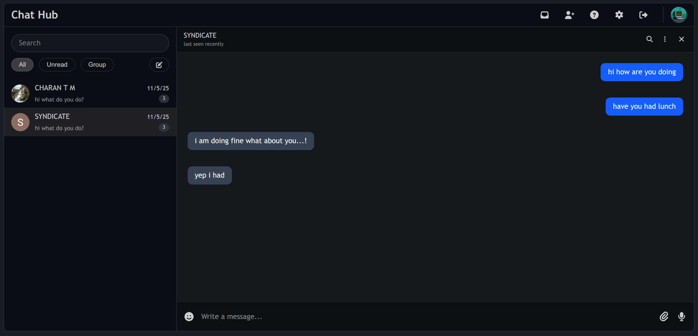

# Chat-Hub

Your central hub for seamless, real-time conversations.</br>
> **A modern realtime chat application built with FastAPI and React, featuring secure JWT authentication and a user-friendly UI.**

#### Chat - View
[](https://github.com/charantm7/Chat-Hub)

## 🛠️ Tech stack and Features

- **Backend**
    - [**FastApi**](https://fastapi.tiangolo.com/) - High performance python webframework.
    - [**SQLAchemy**](https://www.sqlalchemy.org/) - ORM for Database operations.
    - [**Pydantic**](https://docs.pydantic.dev/latest/) - Data validation and setting management.
    - [**PostgreSQL**](https://www.postgresql.org) - SQL Database.
    - [**Alembic**](https://alembic.sqlalchemy.org/en/latest/) - Database migrations.

- **Frontend**
    - [**React**](https://react.dev/) - modern frontend JS framework.
    - [**TailwindCSS**](https://tailwindcss.com/) - Styling.
    - Used Javascript, vite and latest frontend packages.
 
- [Docker Compose](https://www.docker.com) for development and production.
- OAuth (Google) - Social Auth provider.
- Secure JWT (JSON Web Token) authentication.
- Tests with [Pytest](https://pytest.org).

## ✨ Features
- Real-time messaging with WebSockets
- JWT-based authentication & Google OAuth login
- User-to-user and group chat support
- Comprehensive tests with Pytest
- Dockerized setup for quick local development and deployment

## 🚀 Getting Started
- Clone the Repository
```bash
git clone https://github.com/charantm7/Chat-Hub.git
cd Chat-Hub
````
- Run with Docker
```bash
docker-compose up --build
````
- Access Endpoints
```bash
Frontend -> http://localhost:5173
API -> http://localhost:8000/docs
````
## Local Development (without Docker)
- Virtual env
```bash
python -m venv venv
source venv/bin/activate (Linux)
venv\Scripts\activate (Windows)
````
- Backend
```bash
cd backend
pip install -r requirements.txt
uvicorn main:app --reload
````
- Frontend
```bash
cd frontend
npm install
npm run dev
````
## 🤝 Contributing
contributions are welcome!
- Fork the Repo
- Create a feature branch `git checkout -b feature-xyz`
- Commit changes `git commit -m "Added feature XYZ"`
- Push changes `git push origin feature-xyz`
- Open pull request
